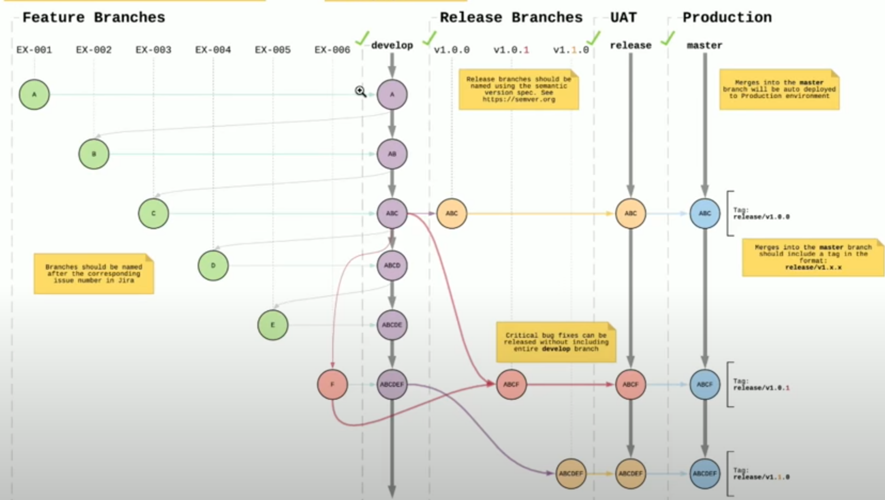

# Version Control
This document details how to implement version control for this project.

Branches:
- main 
  - The production branch, code should be bug free for deployment on live environment for target audience to view.
- staging
  - Accessible to the 'client' and team for testing and adjustments as it appears on live environment. Once ready for full-live site environment swap with the production server (*This needs work*).
- development
  - This is for the newest developments to the site. Once at a point of being ready for testing or checking on live environment send to staging.
- experiment/feature
  - Start here for creating a new feature or experimenting, once working move it into the development branch. 

### Local Development
Process:
1. Create a experiment/feature branch
2. Code and make changes
3. Test functionality in local environment
4. Commit changes
5. Create pull request to development branch
6. -- Someone must review changes, accept and merge --

### Staging 
Process: 
1. Create pull request to staging
2. --Someone must review changes, accept and merge--
3. Check on live environment and test site
4. Create pull request to merge with main *This needs work*

### Main/Production
Process:
1. Swap staging and production *This needs work*
